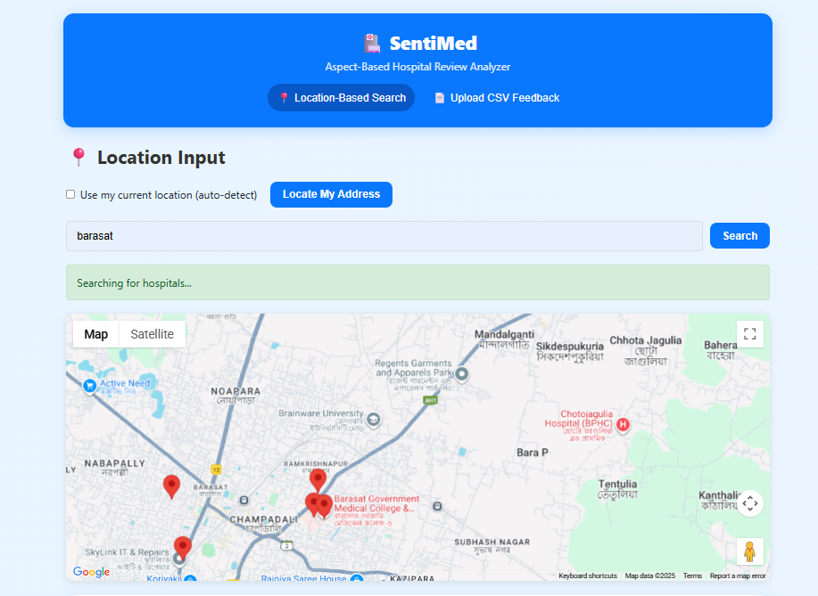
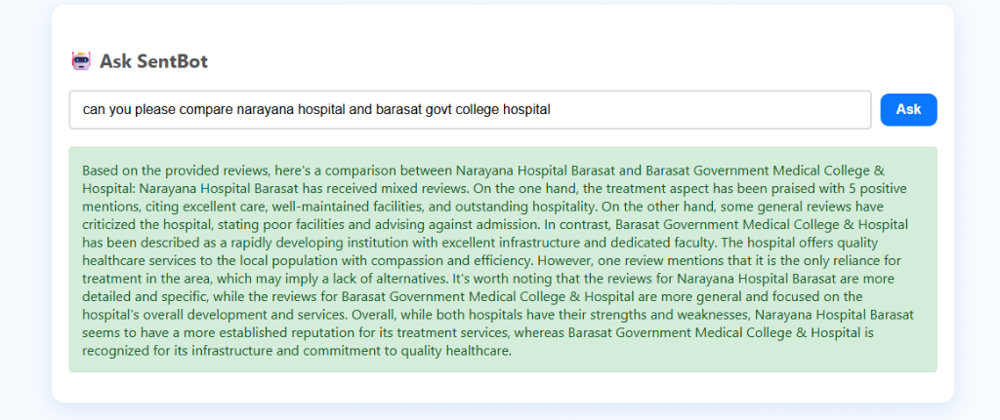

# SentiMed - AI-Powered Hospital Review Analyzer & Recommendation System

SentiMed is an advanced healthcare analytics platform that leverages AI to analyze hospital reviews, provide location-based hospital recommendations, and offer interactive sentiment insights using a RAG-based chatbot.

## Features

*   **Location-Based Search**: Find hospitals near you using Google Maps API.
*   **Aspect-Based Sentiment Analysis**: Analyzes reviews for specific aspects like cleanliness, staff behavior, and treatment quality.
*   **Interactive Dashboard**: Visualize sentiment data with word clouds and charts.
*   **RAG-Powered Chatbot (SentBot)**: Ask questions about hospital reviews and get AI-generated answers grounded in real user feedback.
*   **Recommendation System**: hybrid recommendation engine combining location and sentiment scores.

## Screenshots

### 1. Interactive Dashboard & Location Search
Explore hospital sentiments and find nearby healthcare facilities with our intuitive dashboard.


### 2. AI Chatbot (SentBot)
Ask specific questions about hospitals and get detailed comparisons and insights.


## Tech Stack

*   **Backend**: FastAPI (Python)
*   **Frontend**: HTML, CSS, JavaScript (Jinja2 Templates)
*   **AI/ML**: 
    *   **BERT Finetune**: Custom fine-tuned BERT model for aspect extraction and sentiment analysis.
    *   Sentence Transformers (`all-MiniLM-L6-v2`) for embeddings
    *   Groq API (Llama 3) for LLM inference
    *   In-memory Vector Store for RAG
*   **APIs**: Google Maps API

## Installation

1.  Clone the repository:
    ```bash
    git clone https://github.com/amitkarmakar07/SentiMed-FastAPI.git
    cd SentiMed-FastAPI
    ```

2.  Install dependencies:
    ```bash
    pip install -r requirements.txt
    ```

3.  Set up environment variables in `.env`:
    ```
    GOOGLE_MAPS_API_KEY=your_key_here
    GROQ_API_KEY=your_key_here
    ```

4.  Run the application:
    ```bash
    python main.py
    ```
    Access the app at `http://localhost:8000`.

## Deployment to Render (Free Tier)

This application is ready to be deployed on Render for free.

1.  **Sign up/Login to Render**: Go to [render.com](https://render.com).
2.  **New Web Service**: Click "New +" and select "Web Service".
3.  **Connect GitHub**: Select "Build and deploy from a Git repository" and connect your GitHub account.
4.  **Select Repository**: Choose `SentiMed-FastAPI`.
5.  **Configure**:
    *   **Name**: `sentimed-app` (or any name you like)
    *   **Region**: Closest to you (e.g., Singapore, Frankfurt)
    *   **Branch**: `main`
    *   **Runtime**: `Python 3`
    *   **Build Command**: `pip install -r requirements.txt`
    *   **Start Command**: `gunicorn main:app -w 4 -k uvicorn.workers.UvicornWorker`
6.  **Environment Variables**:
    Scroll down to "Advanced" -> "Environment Variables" and add:
    *   `GOOGLE_MAPS_API_KEY`: *[Your Google Maps API Key]*
    *   `GROQ_API_KEY`: *[Your Groq API Key]*
7.  **Create Web Service**: Click the button to deploy.

*Note: The free tier has 512MB RAM. The `all-MiniLM-L6-v2` embedding model is optimized to fit within this limit, but heavy usage might trigger restarts.*

## License

MIT
